# Specter — Architecture

This document explains how the framework is built internally. It is aimed at contributors and advanced users who need to understand what is happening under the hood.

---

## Layer model

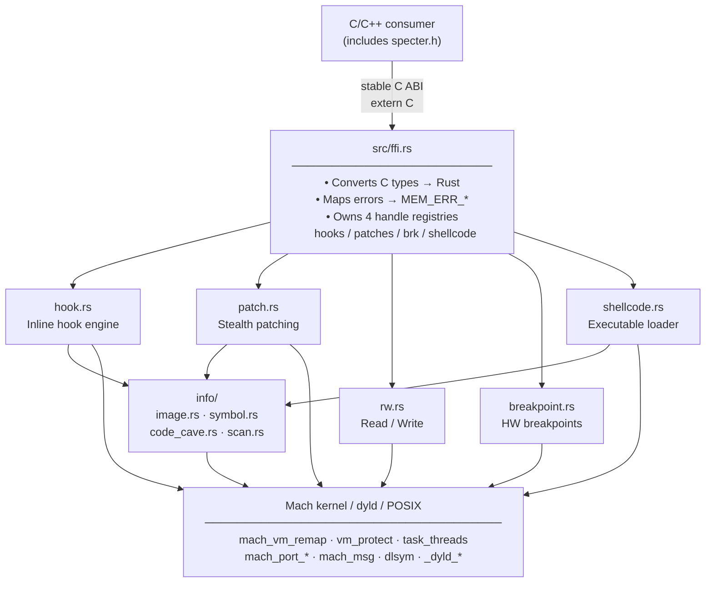

---

## Initialization (`src/config.rs`)

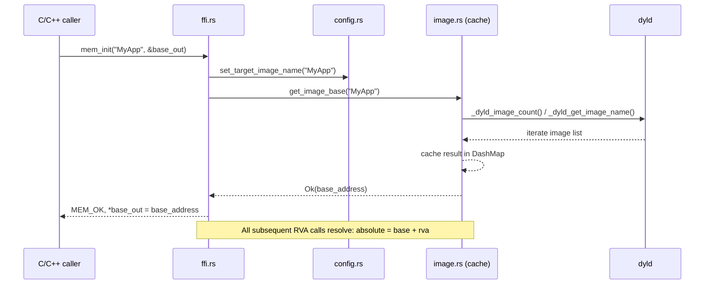

---

## Inline hook engine (`src/memory/manipulation/hook.rs`)

### Standard hook — full flow

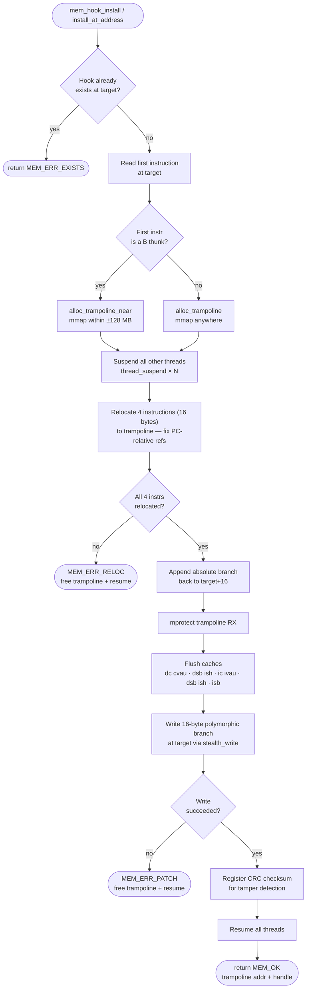

### Instruction relocation logic

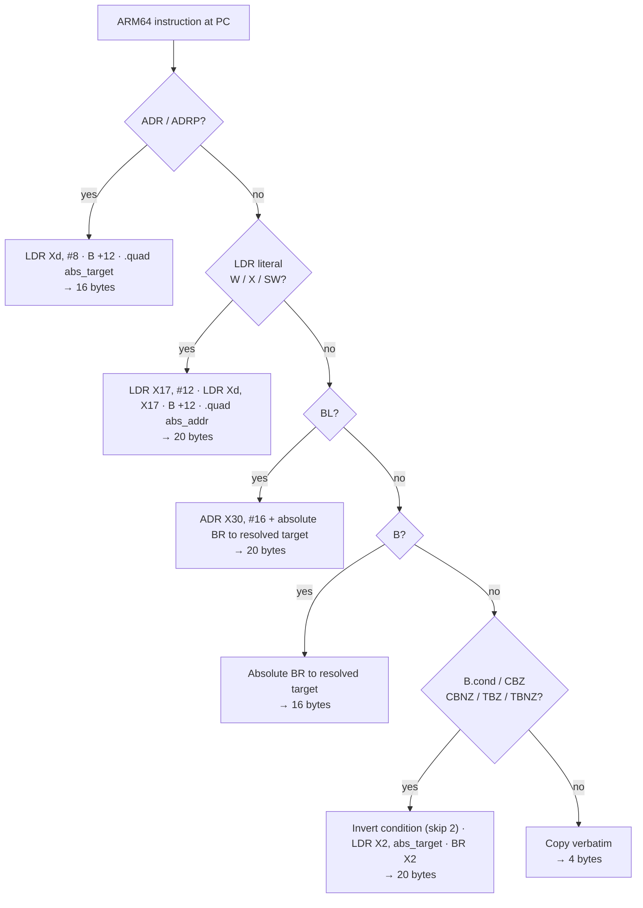

### Polymorphic branch encoding

Each hook redirect is randomly varied on every install using `arc4random()` — two hooks to the same address installed at different times will produce different bytes.

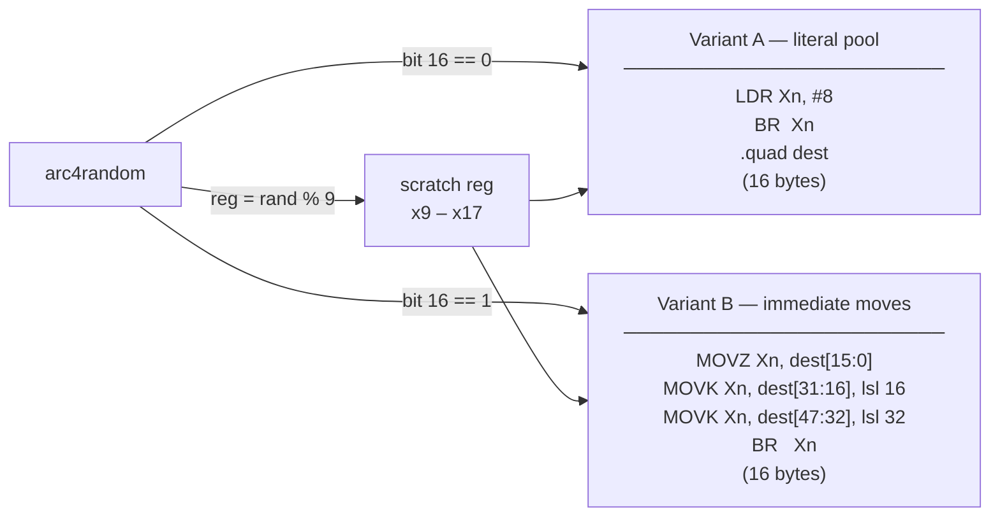

### Code-cave hook

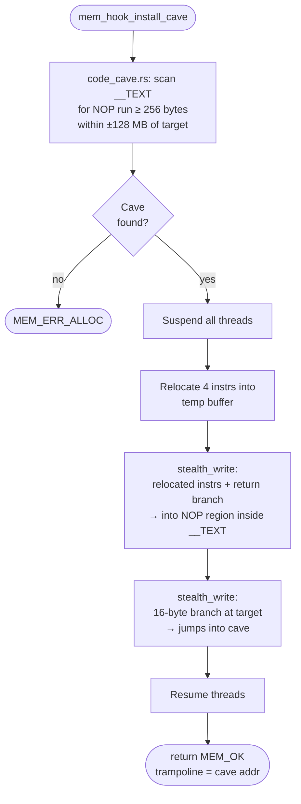

> The trampoline lives **inside the image's own `__TEXT` segment**, invisible to scanners that enumerate anonymous `mmap` pages.

---

## Stealth patching (`src/memory/manipulation/patch.rs`)

The standard `vm_protect(RW) → write → vm_protect(RX)` sequence is observable by security frameworks that monitor permission changes on executable pages. Specter avoids it entirely.

### mach_vm_remap write path

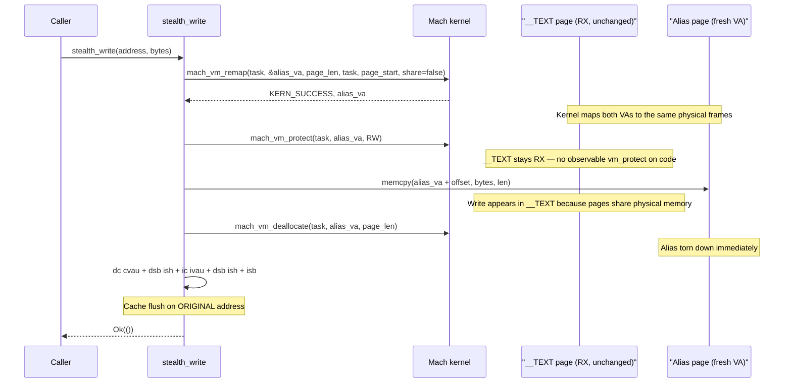

### Full patch lifecycle

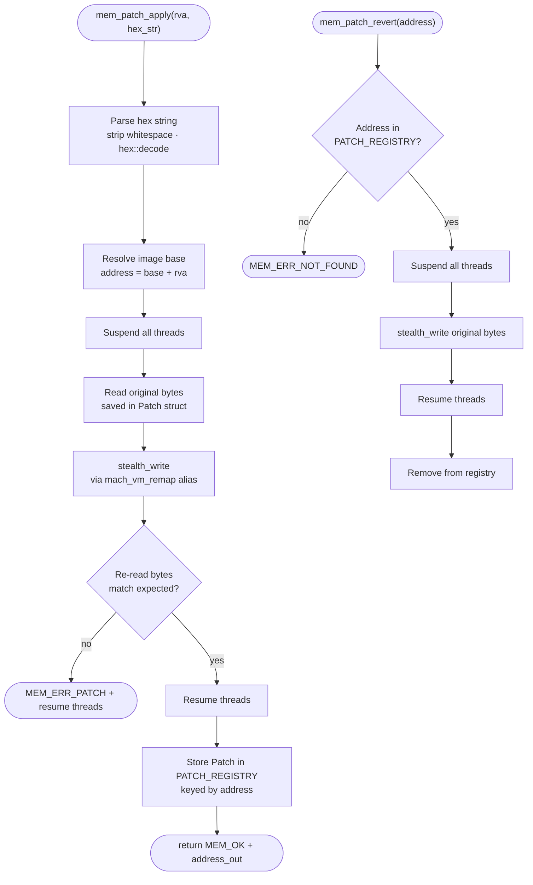

### Fallback path (when remap is unavailable)

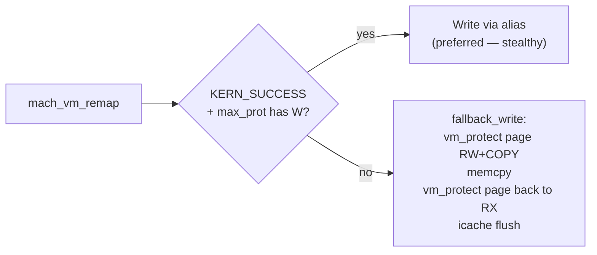

---

## Hardware breakpoints (`src/memory/platform/breakpoint.rs`)

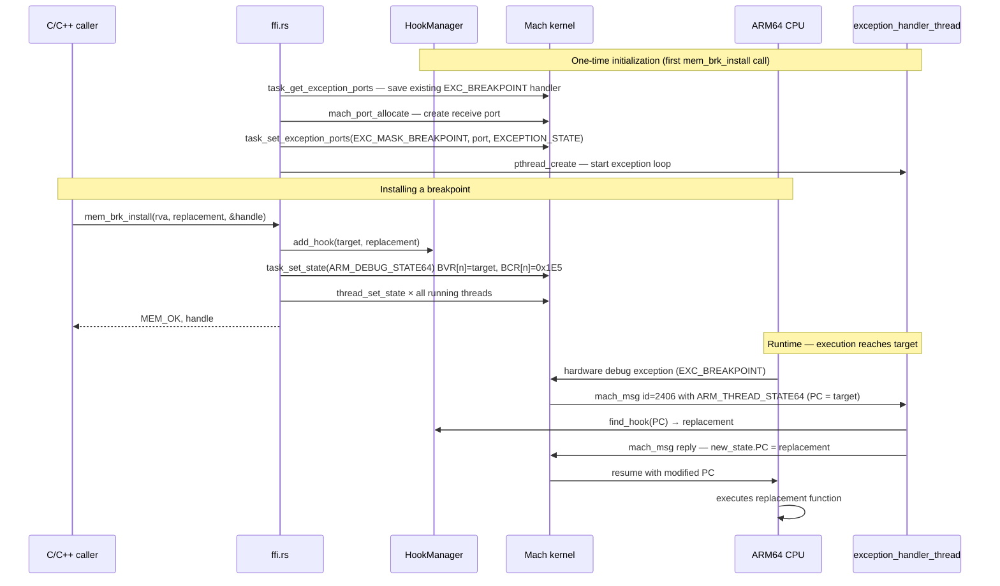

### Breakpoint slot management

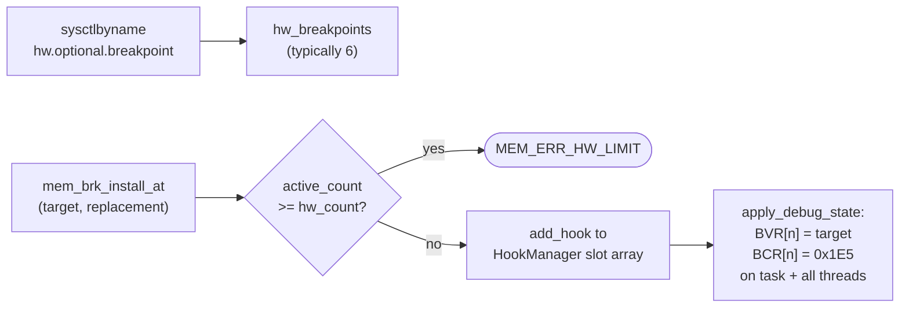

---

## Read / Write (`src/memory/manipulation/rw.rs`)

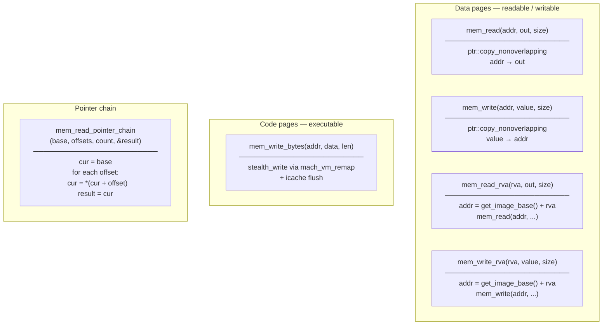

### Pointer chain traversal

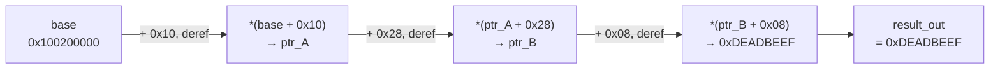

---

## Symbol resolution (`src/memory/info/symbol.rs`)

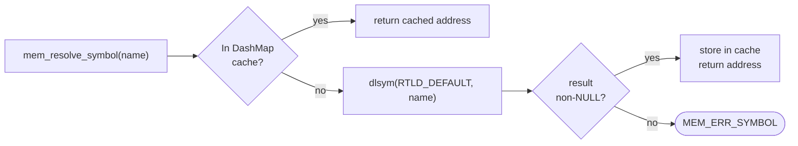

---

## Concurrency model

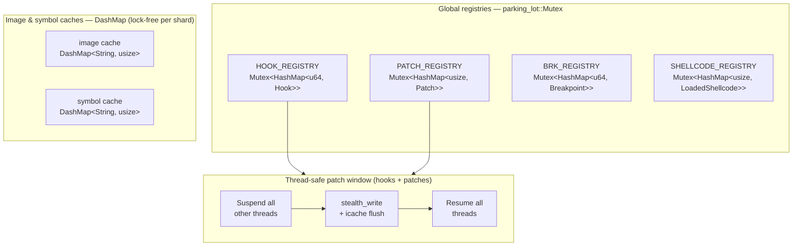

> All hook and patch operations bracket the write inside a Mach thread-suspension window. This eliminates any race where another thread could execute partially-written hook bytes or observe an inconsistent instruction stream.
