# Architecture

Internal design documentation for contributors and advanced users.

---

## Platforms

Specter builds for both **iOS** (`aarch64-apple-ios`) and **macOS** (`aarch64-apple-darwin`). Both targets share the same codebase — all APIs use Mach kernel and dyld primitives available on both platforms. `make` builds both; `make ios` or `make macos` for a single target.

---

## Layer Model

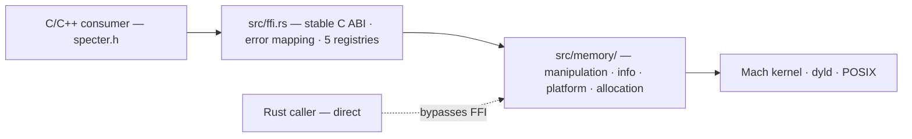

### Two consumption modes

1. **C/C++ via FFI** — link `libspecter.a`, include `specter.h`. The FFI layer (`src/ffi.rs`) manages handle registries and maps Rust errors to `MEM_ERR_*` codes.
2. **Rust direct** — use `specter::memory::*` modules directly. No FFI overhead, full access to Rust types (`Hook`, `Patch`, `Breakpoint`, `LoadedShellcode`).

---

## Initialization (`src/config.rs`)

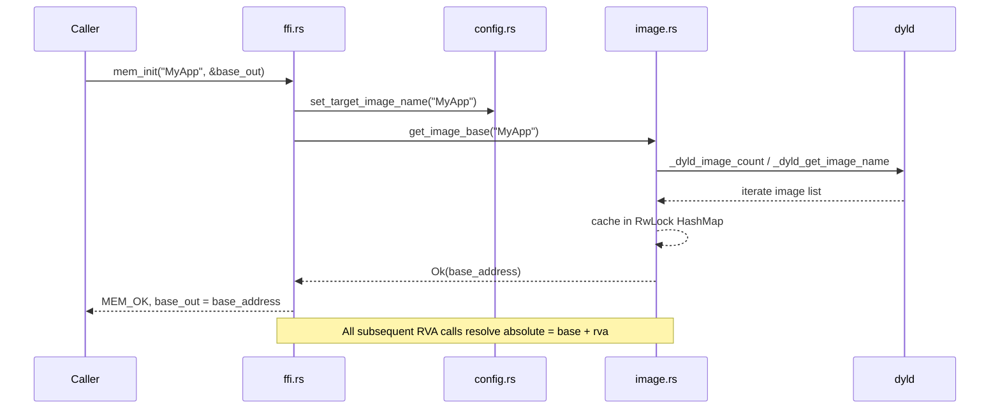

The target image name is stored in a `RwLock<Option<String>>` in `config.rs`. The image cache in `image.rs` uses a `RwLock<HashMap>` for thread-safe lookups.

---

## Inline Hook Engine (`src/memory/manipulation/hook.rs`)

### Standard hook — full flow

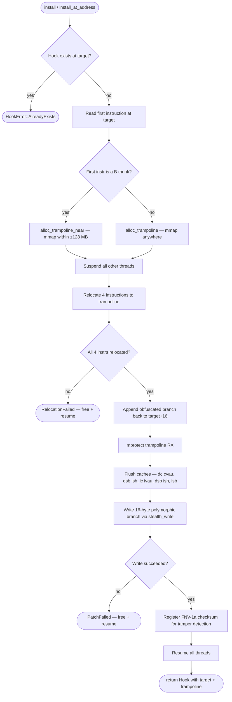

### Instruction relocation

The trampoline must contain the 4 original instructions relocated to a new address. PC-relative instructions need fixup:

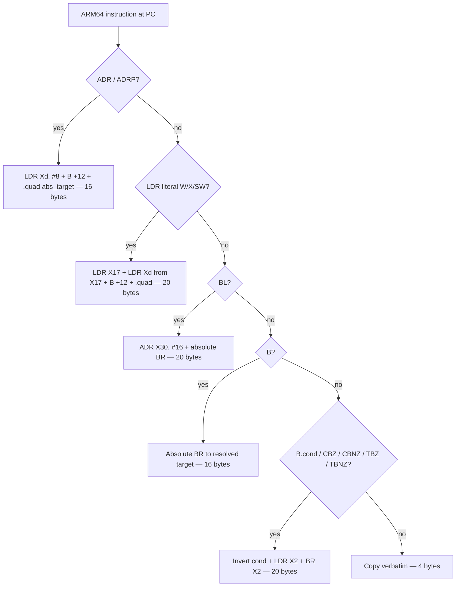

### Polymorphic branch encoding

Each hook redirect is randomly varied on every install using `arc4random()` — two hooks to the same address will produce different bytes.

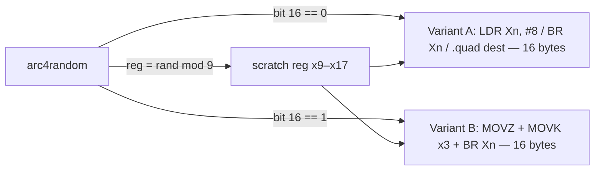

Obfuscated branches (used in trampolines) prepend a random junk sled (1–4 NOP/self-move instructions) and optionally an opaque predicate before the actual branch.

### Code-cave hook

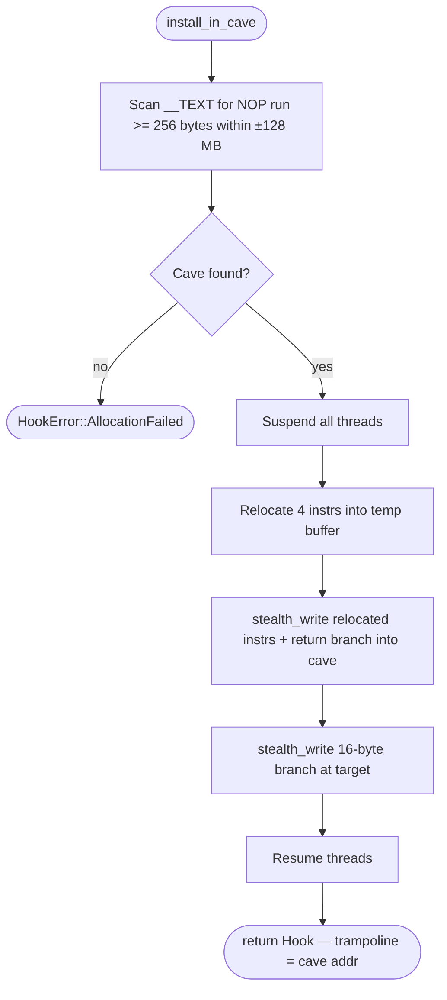

> The trampoline lives **inside the image's own `__TEXT` segment**, invisible to scanners that look for anonymous `mmap` pages.

---

## Integrity Monitor (`src/memory/manipulation/checksum.rs`)

A background thread periodically verifies that installed hooks haven't been tampered with.

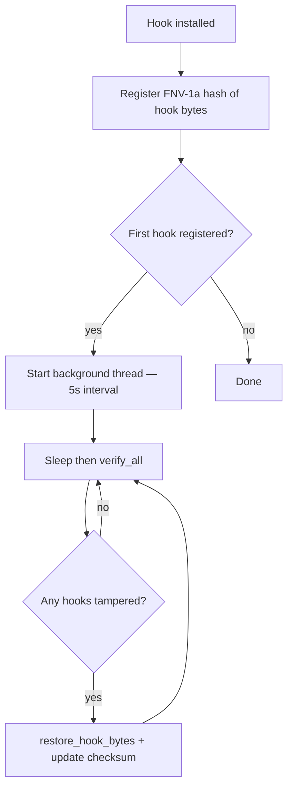

The monitor uses FNV-1a hashing (fast, non-cryptographic) to compare current bytes against the expected state. On tamper detection, it automatically re-writes the hook redirect bytes via `restore_hook_bytes`.

---

## Stealth Patching (`src/memory/manipulation/patch.rs`)

The standard `vm_protect(RW) → write → vm_protect(RX)` sequence is observable by security frameworks. Specter avoids it.

### mach_vm_remap write path

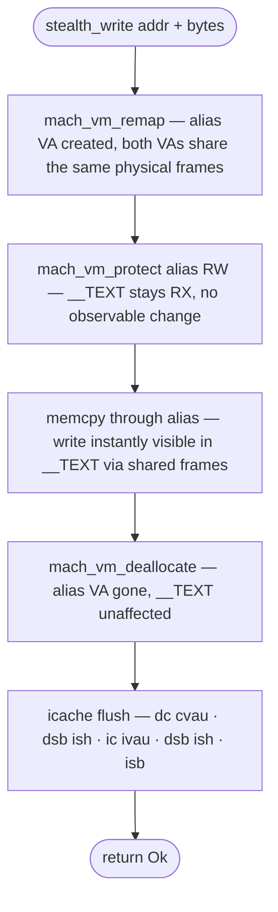

### Patch lifecycle

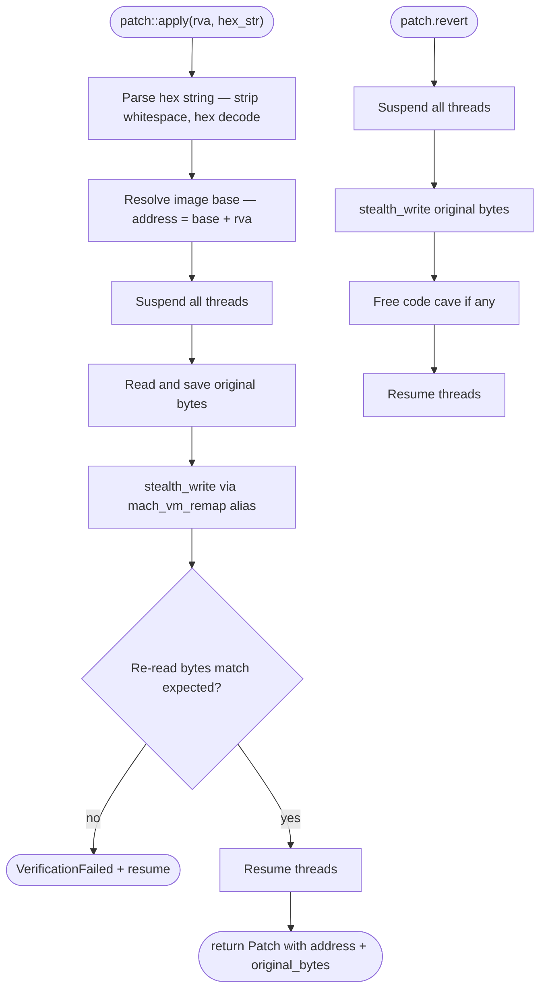

### Assembly patches

`patch::apply_asm` and `patch::apply_asm_in_cave` accept a closure that builds ARM64 instructions using the `jit-assembler` crate:

```
patch::apply_asm(rva, |asm| asm.nop().ret())
```

The builder generates `Vec<u32>` instructions which are serialized to bytes and written through the same stealth path.

### Fallback path

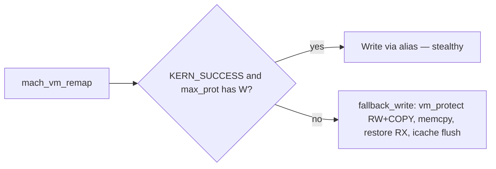

---

## Hardware Breakpoints (`src/memory/platform/breakpoint.rs`)

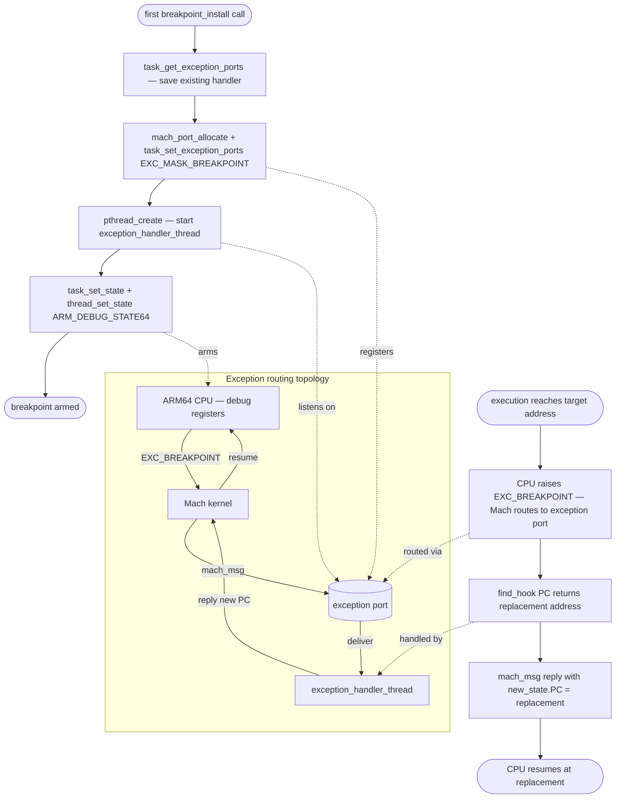

### Slot management

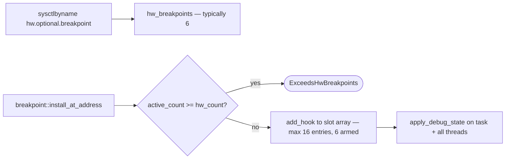

### Calling the original

`Breakpoint::call_original` temporarily clears debug registers on the current thread (`suspend_self`), calls the original function, then re-arms them (`resume_self`). This avoids infinite recursion.

---

## Code Cave Finder (`src/memory/info/code_cave.rs`)

Scans the target image for reusable NOP regions and zero-byte alignment padding.

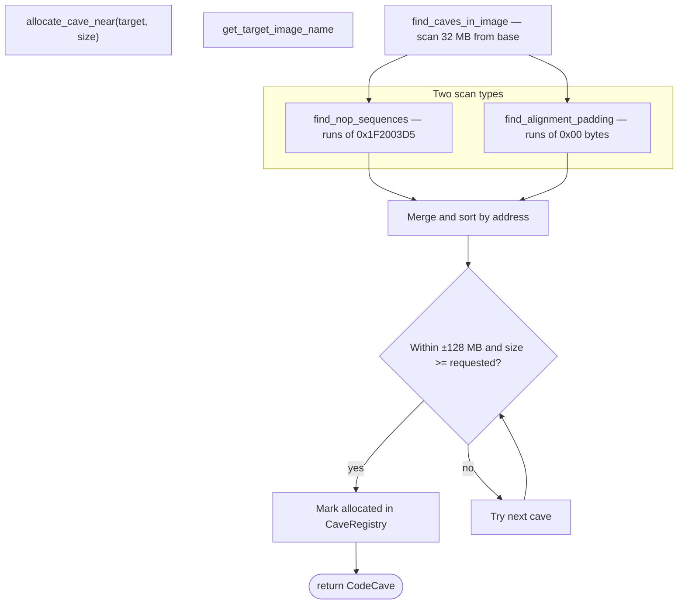

The `CaveRegistry` (`Mutex<HashMap<usize, CodeCave>>`) tracks allocated caves to prevent double allocation. Caves are freed when hooks/patches are reverted.

---

## Memory Read / Write (`src/memory/manipulation/rw.rs`)

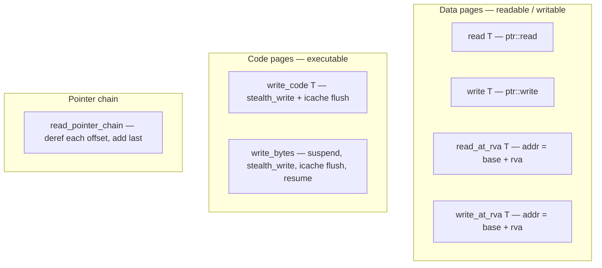

### Pointer chain traversal

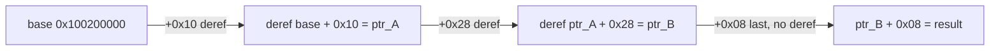

---

## Pattern Scanning (`src/memory/info/scan.rs`)

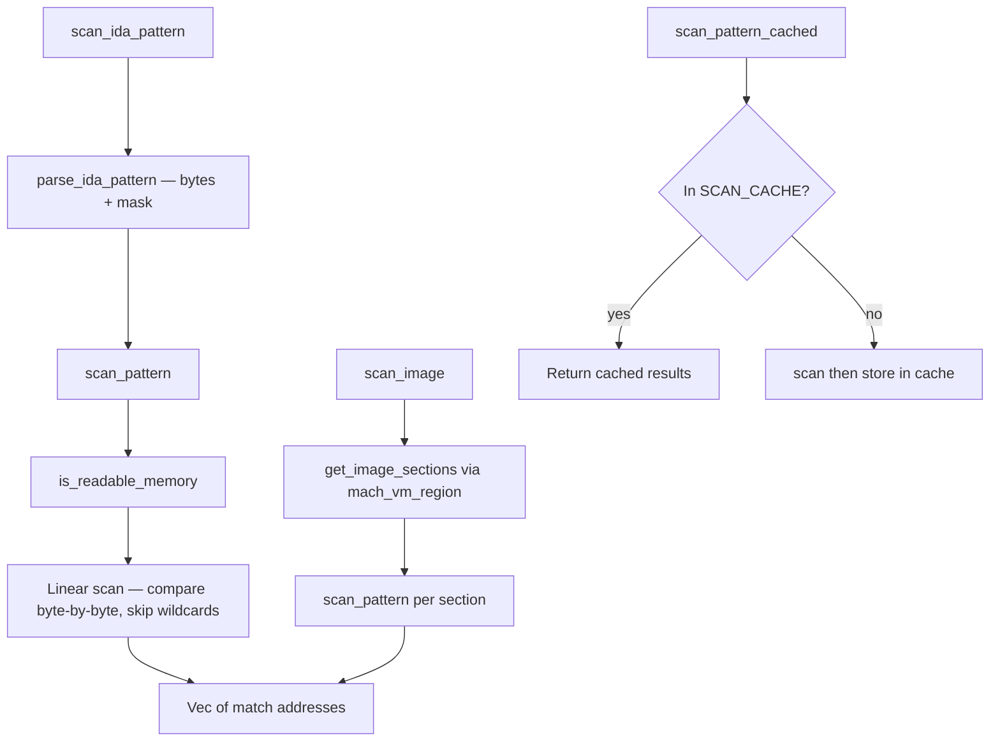

---

## Symbol Resolution (`src/memory/info/symbol.rs`)

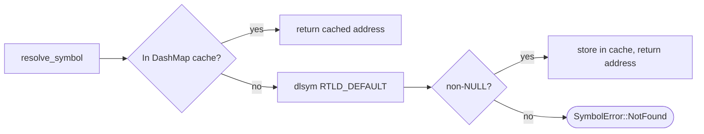

---

## Shellcode Loader (`src/memory/allocation/shellcode.rs`)

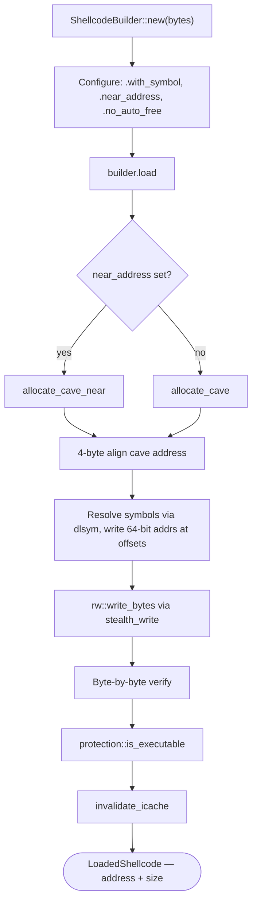

`LoadedShellcode` supports:
- `execute()` — call as `extern "C" fn() -> usize`
- `execute_as(|f| f(...))` — call with custom signature
- `as_function::<F>()` — get a raw function pointer
- Auto-cleanup on drop (unless `.no_auto_free()` was used)

---

## Thread Safety (`src/memory/platform/thread.rs`)

All hook and patch operations bracket the write inside a Mach thread-suspension window:


---

## Concurrency Model

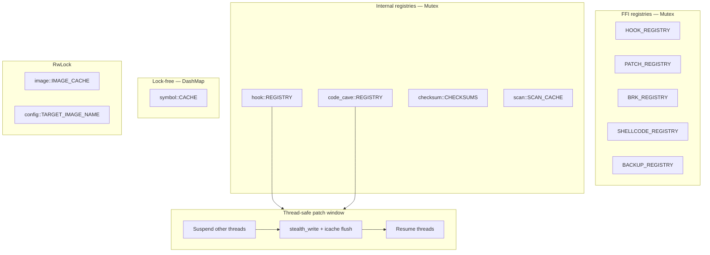

> All hook and patch operations bracket the write inside a Mach thread-suspension window. This eliminates races where another thread could execute partially-written hook bytes.

### Lock hierarchy

To prevent deadlocks, locks are always acquired in this order when multiple are needed:
1. Thread suspension (outermost)
2. FFI registries
3. Internal registries (hook, cave, checksum)
4. Caches (symbol, image, scan)

---

## Memory Protection (`src/memory/info/protection.rs`)

Wraps `mach_vm_region` and `mach_vm_protect` with a typed `PageProtection` abstraction.

| Function | Description |
|----------|-------------|
| `get_protection(addr)` | Query current RWX flags |
| `get_region_info(addr)` | Full region metadata (address, size, protection) |
| `find_region(addr)` | Find region containing or following address |
| `protect(addr, size, prot)` | Change protection flags |
| `is_readable/writable/executable(addr)` | Quick boolean checks |
| `get_all_regions()` | Enumerate all readable regions in the process |

Used internally by the scan engine (to verify readability before scanning), the code cave finder, and the fallback write path. Also exposed via the C FFI for direct use by consumers.

---

## Mach-O Segment/Section Querying (`src/memory/info/macho.rs`)

Queries named segments and sections of loaded Mach-O images via Darwin's `getsegmentdata()` and `getsectiondata()` C functions. The image base address (from `get_image_base`) is cast to a `mach_header_64*` for these calls.

| Function | Description |
|----------|-------------|
| `get_segment(image_name, seg_name)` | Get segment address, end, and size |
| `get_section(image_name, seg_name, sect_name)` | Get section within a segment |

Returns `SegmentData { start, end, size }`. Useful for targeted scanning — e.g., scan only `__TEXT,__text` instead of the entire image.

---

## Image Enumeration (`src/memory/info/image.rs`)

Beyond the existing `get_image_base(name)` lookup, the image module now provides:

| Function | Description |
|----------|-------------|
| `get_all_images()` | List all loaded images with index, name, and base |
| `image_count()` | Total number of loaded dyld images |
| `get_image_name(index)` | Full path of an image by dyld index |

All functions call dyld APIs (`_dyld_image_count`, `_dyld_get_image_name`, `_dyld_get_image_header`).

---

## Memory Backup (`src/memory/manipulation/backup.rs`)

Standalone backup and restore mechanism, independent of the patch system. Creates a snapshot of bytes at an address that can be restored later.

```mermaid
flowchart TD
    Create(["MemoryBackup::create(addr, size)"])
    ReadOrig[Read bytes at addr via rw::read]
    Store[Store address + original_bytes]
    Done(["MemoryBackup"])

    Restore(["backup.restore()"])
    Suspend[Suspend all threads]
    StealthWrite[stealth_write original bytes]
    Resume[Resume threads]

    Create --> ReadOrig --> Store --> Done
    Restore --> Suspend --> StealthWrite --> Resume
```

Backups are tracked in the FFI layer via `BACKUP_REGISTRY` (handle-based, same pattern as hooks).

---

## Patch Introspection

The `Patch` struct now tracks three byte states:

| Field | Description |
|-------|-------------|
| `original_bytes` | Bytes that were overwritten when the patch was applied |
| `patch_bytes` | Bytes that were written as the patch |
| `current_bytes()` | Live read of bytes at the patch address |

Comparing `current_bytes()` against `patch_bytes` detects external modification. The FFI exposes `mem_patch_list`, `mem_patch_count`, `mem_patch_size`, `mem_patch_orig_bytes`, `mem_patch_patch_bytes`, and `mem_patch_curr_bytes` for enumeration and inspection.

---

## Build Artifacts

```
target/
├── aarch64-apple-ios/
│   └── release/
│       └── libspecter.a          ← iOS static library
└── aarch64-apple-darwin/
    └── release/
        └── libspecter.a          ← macOS static library

specter.h                         ← C/C++ header (shared by both)
```
